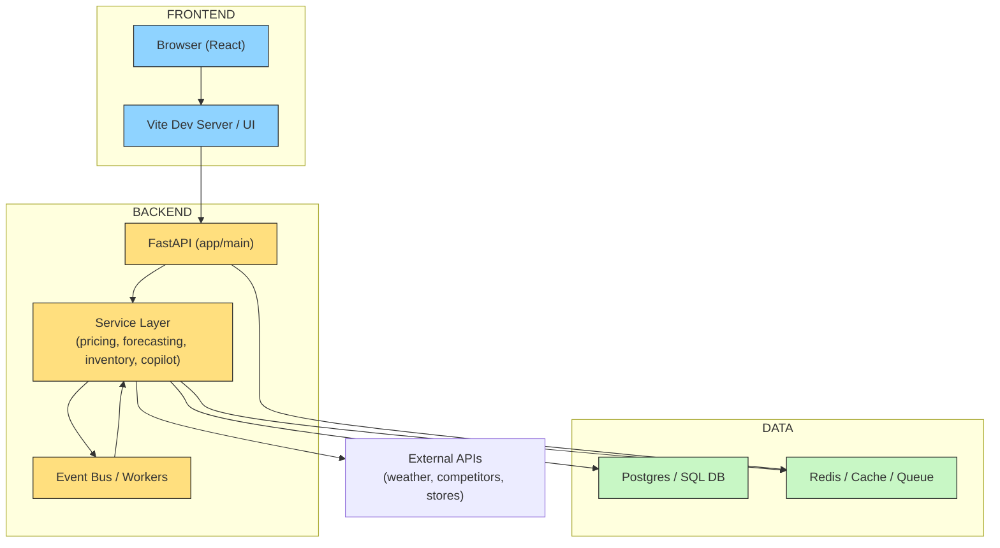

# Architecture Diagram

This file contains a standalone architecture diagram for MerchIQ and a short explanation.

Explanation

- The Browser loads the React app served by Vite (dev) or static assets (prod).
- The frontend makes HTTP calls to the FastAPI backend which routes requests under `backend/app/api/`.
- Business logic lives in the service layer (`backend/app/services/*`), which reads/writes from the primary database and uses Redis for caching and short-lived queues.
- An Event Bus and background workers handle asynchronous tasks (long-running forecasts, batch imports).
- External APIs provide supplementary data (weather, competitor pricing).

How to view

- GitHub will render the Mermaid diagram inside this Markdown file when viewed in the repo.
